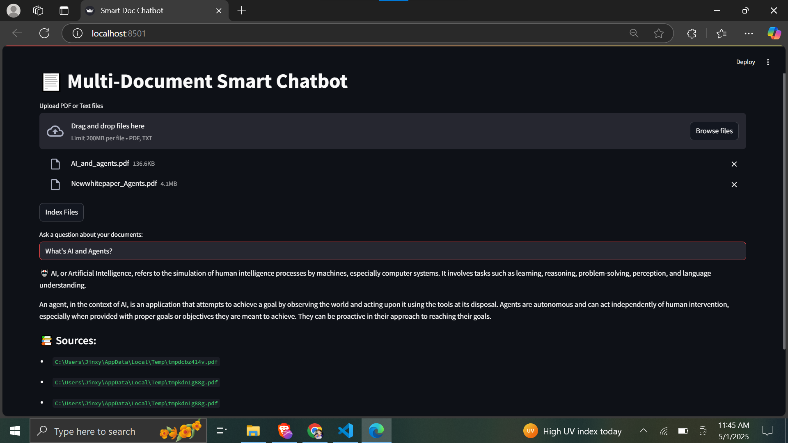

# 📄 Multi-Document Smart Retrieval Chatbot

An AI-powered chatbot built with **Retrieval-Augmented Generation (RAG)** architecture. Users can upload multiple PDF or TXT documents, which are semantically indexed into a vector database (**Qdrant**). Ask natural language questions and get answers grounded in your documents — with source citations for full transparency.

---

### 🧠 What is RAG?

This project is a practical implementation of **Retrieval-Augmented Generation (RAG)** — a GenAI architecture that combines:

- **Retrieval**: Extract the most relevant context from your uploaded documents using semantic search and embeddings.
- **Generation**: Use OpenAI’s GPT-3.5 to generate informed, contextual answers based on the retrieved data.

This allows the chatbot to **answer domain-specific questions** grounded in your own document knowledge base.

---

### 🚀 Features

✅ Upload and index multiple PDF or TXT documents  
✅ Chunking and semantic vector embeddings (OpenAI)  
✅ Q&A with GPT-3.5 using LangChain’s `RetrievalQA`  
✅ Transparent source citations for every answer  
✅ Dockerized app with built-in Qdrant support  
✅ Minimal UI with Streamlit — no frontend hassle

---

### 🛠️ Tech Stack

- **Frontend**: Streamlit  
- **LLM Backend**: OpenAI GPT-3.5 via LangChain  
- **Embedding Model**: OpenAI Embeddings  
- **Vector Store**: Qdrant (Dockerized)  
- **Document Parsing**: PyPDFLoader, TextLoader  
- **Deployment**: Docker & Docker Compose  

---

### 📦 Installation

```bash
git clone https://github.com/darshanchelani/multi-doc-smart-chatbot
cd multi-doc-smart-chatbot
```

Create a `.env` file:

```env
OPENAI_API_KEY=your_openai_key
QDRANT_URL=http://localhost:6333
```

Install dependencies:

```bash
pip install -r requirements.txt
```

Start Qdrant locally using Docker:

```bash
docker-compose up -d
```

Launch the chatbot:

```bash
streamlit run app.py
```

---

### 🐳 Docker Setup (Optional)

Run everything with Docker:

```bash
docker build -t multi-doc-chatbot .
docker run -p 8501:8501 --env-file .env multi-doc-chatbot
```

---

### 💬 How It Works

1. **Upload** PDFs or text files.
2. **Index** chunks with OpenAI embeddings to Qdrant.
3. **Ask** questions in natural language.
4. **Get** GPT-powered answers with referenced source files.

---

### 📷 Preview



---

### 🔗 Powered By

- [LangChain](https://www.langchain.com/)
- [OpenAI](https://platform.openai.com/)
- [Qdrant](https://qdrant.tech/)
- [Streamlit](https://streamlit.io/)

---

### 🤝 Contribution

Found a bug? Want to add a feature? PRs are welcome!  
Feel free to fork and submit your improvements.

